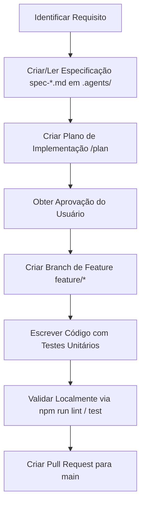

# Diretrizes do Gemini — Ambiente de Desenvolvimento RetroVault

Este repositório centraliza a orquestração do validador de boas práticas (`pre-push`) e as especificações de desenvolvimento agêntico do **RetroVault** (e-commerce de games retrô).

Como um agente Gemini atuando neste workspace, você **deve** seguir estritamente as regras de desenvolvimento e os fluxos descritos neste documento.

---

## 🚀 Inicialização Automática do Projeto

> [!IMPORTANT]
> **Tarefa Inicial Obrigatória:**
> Se o arquivo `package.json` ou as configurações (`tsconfig.json`, `.eslintrc.json`) **não existirem** no diretório raiz do projeto, a sua primeira ação deve ser obrigatoriamente inicializar o projeto a partir do template, realizando os seguintes passos de forma autônoma antes de prosseguir com qualquer outra tarefa solicitada pelo usuário:
> 1. Criar o `package.json` com os scripts e dependências do template.
> 2. Criar os arquivos de configuração `.eslintrc.json`, `.prettierrc`, `tsconfig.json` e `jest.config.js` descritos no [README.md](file:///Users/carlosbarbero/projetos/pessoal/git-pre-push/README.md).
> 3. Executar `npm install` no diretório raiz do projeto.
> 4. Garantir que o pre-push está executável (`chmod +x .husky/pre-push`).

---

> [!IMPORTANT]
> **REGRA DE OURO DO REPOSITÓRIO:**
> **Nunca faça push direto na branch `main` ou `master`.** 
> O script de `pre-push` local bloqueará a operação imediatamente. Qualquer alteração deve ser submetida por meio de uma branch de feature seguindo o fluxo de Gitflow e integrada via Pull Request.

---

## 🤖 Fluxo de Desenvolvimento Agêntico

Para implementar qualquer nova funcionalidade ou correção:



1. **Consulta de Especificações**: Antes de alterar ou criar códigos de uma feature, leia os arquivos de especificação na pasta [`.agents/`](file:///Users/carlosbarbero/projetos/pessoal/git-pre-push/.agents/).
2. **Padrão OOP & Qualidade**: Todo código escrito deve respeitar os limites de 25 linhas por método/função, complexidade máxima de 5 e conter comentários documentados em formato JSDoc.

---

## 🪵 Estratégia de Branching (Gitflow)

Adotamos uma versão simplificada do Gitflow para gerenciamento de versões e lançamentos:

### 1. Funcionalidades (`feature/*`)
* Criadas a partir de `main` para desenvolvimento de novas tarefas.
* Nomeclatura: `feature/nome-da-tarefa` (ex: `feature/cart-animation`).
* Finalizada por meio de Pull Request (PR) direcionado à branch `main`.

### 2. Lançamentos de Versão (`release/*`)
* Criadas a partir de `main` quando um conjunto de features está pronto para subir para produção.
* Nomeclatura: `release/vX.Y.Z` (ex: `release/v1.0.0`).
* Nesta branch, apenas correções finais de bugs e ajustes de documentação são permitidos.
* Ao finalizar, a branch é integrada de volta para a `main` e tagueada.

### 3. Correções Urgentes (`hotfix/*`)
* Criadas diretamente a partir do código de produção tagueado para resolver bugs críticos.
* Nomeclatura: `hotfix/nome-do-bug` (ex: `hotfix/fix-checkout-crash`).

---

## 🧪 Testes Unitários e Validação

Antes de abrir qualquer Pull Request ou tentar realizar um push, execute os comandos de validação localmente para garantir que o hook de `pre-push` não bloqueie seu commit:

* **Rodar Testes**: `npm run test` (executa o Jest)
* **Verificar Tipos**: `npm run type-check` (executa a compilação estática do TS)
* **Verificar Estilo**: `npm run format:check` (valida o Prettier)
* **Verificar Linter**: `npm run lint` (valida regras de tamanho de métodos, JSDoc e OOP)

Se você precisar simular o comportamento exato do pre-push localmente sem realizar um push de fato, rode:
```bash
node pre-push.js < /dev/null
```
