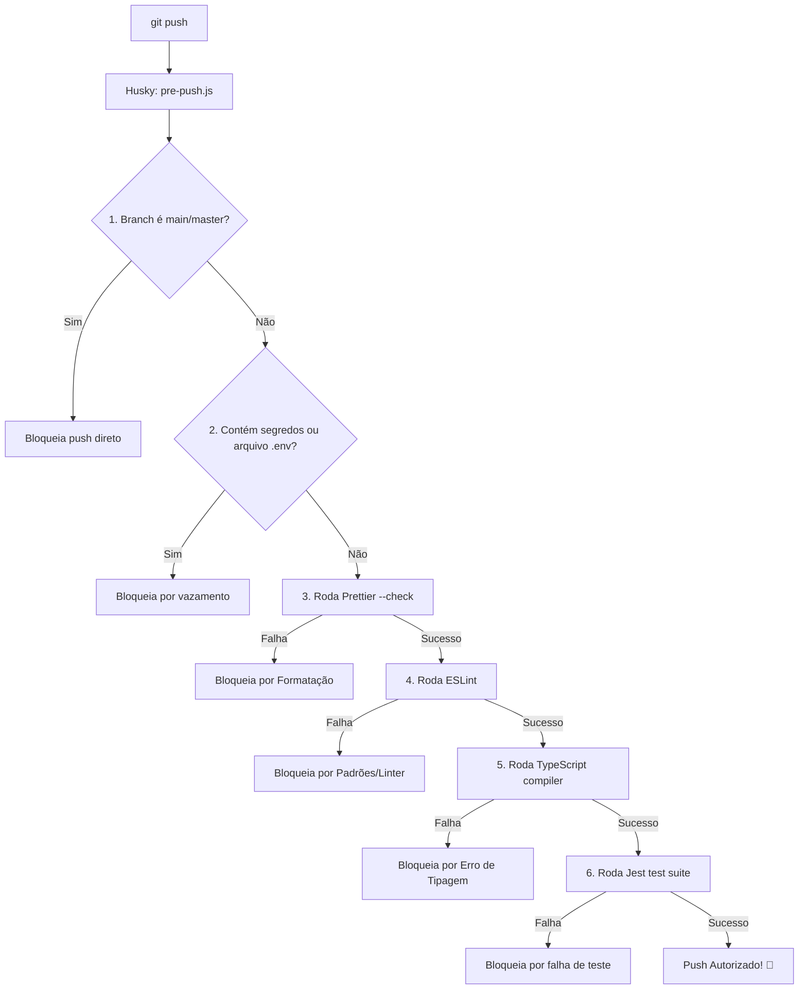

# RetroVault — Template de Desenvolvimento Agêntico & Pre-Push Hook

Este é um repositório template projetado para estruturar o desenvolvimento de aplicações Node.js utilizando **Sistemas Agênticos** (Orquestração por Inteligência Artificial) e **Boas Práticas de Engenharia de Software** forçadas no ciclo do Git através de um hook customizado de `pre-push`.

O objetivo principal deste template é garantir que nenhum código seja enviado para o servidor remoto se violar regras de qualidade de código, segurança, padrões de arquitetura (OOP) ou cobertura de testes.

---

## 📁 Estrutura do Repositório

```text
.
├── .agents/                    # Diretório com a inteligência do sistema agêntico
│   ├── agents/                 # Definição e personas de agentes IA
│   │   ├── backend-engineer.md # Diretrizes de backend para IAs
│   │   └── frontend-engineer.md# Diretrizes de design e UI para IAs
│   ├── skills/                 # Habilidades e padrões de código reutilizáveis por IAs
│   │   ├── nodejs-backend/     # Padrões e arquiteturas de API
│   │   └── nodejs-frontend/    # Padrões visuais CSS, animações e responsividade
│   └── spec-retro-ecommerce.md # Especificação completa do E-commerce de Games Retrô
│
├── .husky/                     # Pasta pública do Husky que instala os ganchos do Git
│   └── pre-push                # Hook de gatilho que executa o pre-push.js
│
├── GEMINI.md                   # Guia de governança, Gitflow e regras obrigatórias de IA
├── pre-push.js                 # Script centralizador do pipeline de validação
└── .gitignore                  # Configuração de arquivos ignorados no repositório
```

---

## 🔒 O Pipeline de Validação (`pre-push.js`)

Toda vez que você (ou um agente autônomo) rodar `git push`, o script `pre-push.js` é executado pelo Husky. Ele avalia os seguintes pontos em sequência:



### Detalhamento das Regras Validadas no ESLint:
* **Tamanho de Métodos**: Máximo de **25 linhas** por método ou função em arquivos de produção (`src/`).
* **Complexidade Ciclomática**: Limite máximo de **5** por método (evita encadeamentos exagerados de condicionais).
* **Parâmetros**: Máximo de **3 parâmetros** por assinatura de função/método.
* **Comentários Obrigatórios**: Uso obrigatório de comentários estruturados em **JSDoc** para todas as classes, métodos e construtores.
* **Interfaces**: Nomes de interfaces TypeScript devem começar com a letra `I` (ex: `IUser`, `IPayment`).

---

## 🚀 Como Iniciar um Projeto do Zero a partir deste Template

### ⚡ Inicialização Automática via Agente de IA

Se você utilizar um agente autônomo (como o Antigravity) para desenvolver o projeto neste repositório, **você não precisa fazer o setup manual descrito abaixo**. 

Conforme definido em [GEMINI.md](file:///Users/carlosbarbero/projetos/pessoal/git-pre-push/GEMINI.md), o agente detectará automaticamente se as configurações do projeto estão ausentes no carregamento do workspace e executará autonomamente todas as etapas de criação de arquivos e instalação de dependências antes de iniciar a sua primeira tarefa!

### 🛠️ Inicialização Manual

Se preferir realizar as etapas manualmente:

### 1. Clonar e Inicializar o Projeto Node.js
Primeiro, instale as dependências básicas no seu ambiente:
```bash
# Inicialize o arquivo package.json
npm init -y
```

### 2. Instalar as Dependências de Desenvolvimento Recomendadas
Instale o ecossistema necessário para os validadores do linter e testes:
```bash
npm install --save-dev typescript @types/node eslint prettier husky jest ts-jest @typescript-eslint/parser @typescript-eslint/eslint-plugin eslint-plugin-jsdoc
```

### 3. Configurar os Scripts no seu `package.json`
Certifique-se de adicionar estes scripts sob a chave `"scripts"` do seu `package.json`:
```json
"scripts": {
  "test": "jest",
  "lint": "eslint \"src/**/*.ts\"",
  "format:check": "prettier --check \"src/**/*.ts\"",
  "format:write": "prettier --write \"src/**/*.ts\"",
  "type-check": "tsc --noEmit",
  "prepare": "husky"
}
```

### 4. Inicializar o Husky e os Hooks Locais
Execute o comando abaixo para que o Husky configure os ganchos do Git locais apontando para o script:
```bash
npm run prepare
chmod +x .husky/pre-push
```

### 5. Criar os Arquivos de Configuração de Boas Práticas

#### `.eslintrc.json` (Linter & Regras OOP)
```json
{
  "parser": "@typescript-eslint/parser",
  "plugins": ["jsdoc"],
  "extends": [
    "eslint:recommended",
    "plugin:@typescript-eslint/recommended",
    "plugin:jsdoc/recommended-typescript"
  ],
  "parserOptions": {
    "ecmaVersion": 2022,
    "sourceType": "module"
  },
  "rules": {
    "no-console": "warn",
    "@typescript-eslint/no-unused-vars": ["error", { "argsIgnorePattern": "^_" }],
    "max-lines-per-function": ["error", { "max": 25, "skipBlankLines": true, "skipComments": true }],
    "complexity": ["error", 5],
    "max-params": ["error", 3],
    "@typescript-eslint/naming-convention": [
      "error",
      {
        "selector": "interface",
        "format": ["PascalCase"],
        "custom": {
          "regex": "^I[A-Z]",
          "match": true
        }
      }
    ],
    "jsdoc/require-jsdoc": [
      "error",
      {
        "require": {
          "FunctionDeclaration": true,
          "MethodDefinition": true,
          "ClassDeclaration": true,
          "ArrowFunctionExpression": false,
          "FunctionExpression": false
        }
      }
    ],
    "jsdoc/require-description": ["error", { "contexts": ["any"] }]
  },
  "overrides": [
    {
      "files": ["src/__tests__/**/*.ts", "**/*.test.ts"],
      "rules": {
        "max-lines-per-function": "off",
        "jsdoc/require-jsdoc": "off"
      }
    }
  ]
}
```

#### `.prettierrc` (Formatação)
```json
{
  "semi": true,
  "singleQuote": true,
  "tabWidth": 2,
  "trailingComma": "all",
  "printWidth": 80
}
```

#### `tsconfig.json` (TypeScript)
```json
{
  "compilerOptions": {
    "target": "ES2022",
    "module": "NodeNext",
    "moduleResolution": "NodeNext",
    "lib": ["ES2022"],
    "strict": true,
    "esModuleInterop": true,
    "skipLibCheck": true,
    "forceConsistentCasingInFileNames": true,
    "outDir": "./dist",
    "noEmit": true,
    "isolatedModules": true
  },
  "include": ["src/**/*"]
}
```

#### `jest.config.js` (Testes com suporte a TS)
```javascript
/** @type {import('ts-jest').JestConfigWithTsJest} */
module.exports = {
  preset: 'ts-jest',
  testEnvironment: 'node',
  testMatch: ['**/__tests__/**/*.ts', '**/?(*.)+(spec|test).ts'],
  transform: {
    '^.+\\.tsx?$': ['ts-jest', { useESM: true }],
  },
};
```

---

## 🪵 Workflow do Git (Gitflow)

1. **Desenvolvimento de Features**: Crie sempre branches a partir da `main` no formato `feature/nome-da-tarefa`.
2. **Push**: Faça os commits respeitando os limites OOP locais e envie para o remoto (`git push origin feature/nome-da-tarefa`). O hook local validará todo o seu código.
3. **Integração**: Abra um Pull Request do GitHub para a `main`.

> [!TIP]
> Caso necessite simular a validação do `pre-push` localmente sem precisar dar push de fato, basta rodar:
> `node pre-push.js < /dev/null`

---

## 🤖 Fluxo Agêntico

Qualquer agente autônomo de IA que for atuar no desenvolvimento deste projeto deve se basear nos guias em:
* [GEMINI.md](file:///Users/carlosbarbero/projetos/pessoal/git-pre-push/GEMINI.md) — As regras de governança de ciclo de vida.
* [`.agents/spec-retro-ecommerce.md`](file:///Users/carlosbarbero/projetos/pessoal/git-pre-push/.agents/spec-retro-ecommerce.md) — As regras e requisitos do produto a ser construído.
* [`.agents/agents/`](file:///Users/carlosbarbero/projetos/pessoal/git-pre-push/.agents/agents/) — Personas dos desenvolvedores de Backend e Frontend.
* [`.agents/skills/`](file:///Users/carlosbarbero/projetos/pessoal/git-pre-push/.agents/skills/) — Habilidades e boas práticas específicas das camadas do sistema.
