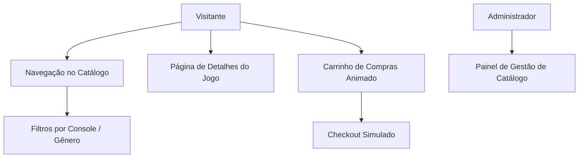

# Especificação Técnica e Funcional — E-Commerce de Games Retrô (RetroVault)

Esta especificação define os requisitos funcionais, arquitetura técnica e padrões de design para a plataforma **RetroVault** (e-commerce de consoles e jogos clássicos).

---

## 🎨 Identidade Visual e Estética (Retro-Futurista)

A estética da plataforma deve ser **Retro-Futurista / Cyberpunk de Luxo**:
* **Fundo**: Sleek Dark Mode (preto profundo e tons de cinza grafite).
* **Cores de Destaque**: Neon violeta, ciano radiante e gradientes magenta.
* **Efeitos**: Glassmorphism (efeito vidro fosco com sombras de neon) e scanlines sutis na hero section evocando as telas de CRT antigas.
* **Tipografia**: Fontes modernas sans-serif (como Orbitron ou Outfit) combinadas com títulos em letras digitais pixelizadas estilizadas.

---

## 📋 Requisitos Funcionais



### 1. Catálogo de Jogos (NES, SNES, Mega Drive, PS1, N64, Game Boy)
* Busca em tempo real por título.
* Filtros rápidos por console (ex: "Nintendo", "Sega", "Sony") e por gênero (ex: "Aventura", "RPG", "Luta").
* Grade de produtos com cards interativos. Hover aciona zoom da capinha do jogo e exibe badges de raridade (ex: *Comum*, *Raro*, *Muito Raro*).

### 2. Carrinho Lateral Dinâmico
* Painel lateral deslizante (*slide-over*) animado mostrando os itens adicionados.
* Atualização de quantidades em tempo real com efeitos de transição numérica.
* Resumo do subtotal com opção de botão animado de checkout.

### 3. Página de Detalhe do Produto
* Visualização da mídia: Imagem da arte da caixa (*box art*) original + carrossel de capturas de tela (*screenshots*) retrô.
* Ficha técnica detalhada (desenvolvedora, ano de lançamento, condição do cartucho/disco).

### 4. Checkout Simulado
* Formulário de preenchimento elegante (detalhes de pagamento fictícios).
* Confirmação de pedido com animação de "Fim de Jogo" (*Victory Screen* ou *Stage Clear* em pixel-art).

### 5. Download Automático de Imagens/Thumbnails (Sem Interação Manual)
* Para garantir a fidelidade visual sem exigir uploads manuais ou processos interativos de aprovação, o sistema deve conter um script automatizado de download que baixa as imagens dos jogos (boxart, screenshots, etc.) diretamente a partir do repositório Git [libretro-thumbnails](https://github.com/libretro-thumbnails/libretro-thumbnails).
* O script deve mapear os títulos dos jogos cadastrados no banco de dados e obter de forma autônoma as imagens correspondentes no repositório correspondente de cada console (ex: NES, SNES, Sega), garantindo inicialização 100% autônoma e sem necessidade de interação do usuário para aprovação.

---

## 🛠️ Arquitetura Técnica

### Frontend (React/Vite)
* **Tecnologias**: React, TypeScript, Vanilla CSS (CSS Modules).
* **Roteamento**: React Router DOM.
* **Estado**: React Context API para o Carrinho e Auth.

### Backend (Node.js/Express)
* **Tecnologias**: Node.js, Express, TypeScript, Zod (validação).
* **ORM**: Prisma com banco de dados SQLite (fácil execução local).

### Modelo de Dados (Prisma Schema)

```prisma
model Game {
  id          String   @id @default(uuid())
  title       String
  description String
  price       Float
  rarity      String   // Common, Rare, UltraRare
  console     String   // SNES, MegaDrive, NES, etc.
  stock       Int
  imageUrl    String
  screenshots String[] // URLs das imagens adicionais
}

model Order {
  id        String      @id @default(uuid())
  total     Float
  status    String      // PENDING, COMPLETED
  items     OrderItem[]
  createdAt DateTime    @default(now())
}

model OrderItem {
  id      String @id @default(uuid())
  gameId  String
  orderId String
  quantity Int
  price   Float
  game    Game   @relation(fields: [gameId], references: [id])
  order   Order  @relation(fields: [orderId], references: [id])
}
```

---

## 🔒 Proteção e Qualidade de Código (Regras Git)

O desenvolvimento deste e-commerce deve seguir obrigatoriamente as regras de **pre-push**:
1. Não realizar commits diretamente na `main`.
2. Todos os métodos de persistência e rotas devem conter documentação **JSDoc**.
3. Nenhum método ou rota deve possuir complexidade ciclomática maior que **5** ou tamanho maior que **25 linhas**.
4. Testes unitários (`jest`) devem validar o processamento dos cálculos do carrinho de compras e o fluxo de checkout.
